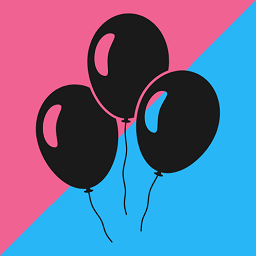

### About me

I currently do Android native development for a financial institution.

### What I use Github for

I recently moved to Github as my version control of choice for my learning/side projects. Most my projects I keep private and only share with those who I collaborate with or solicit feedback from. I do have some public projects.

### What Else

## I’m currently working on...

My own side apps as well as just latching onto whatever new things and Codelabs come out.

## I’m currently learning...

To be a better developer, mostly though continuous development using Android and Kotlin as there is always room to improve. 
I also learn whatever I need to solve problems and come up with different solutions for my personal projects.

## Pronouns: 

He/Him

## Fun facts:

I love dogs. I am newly vegetarian(1+ year). 
 
## Links to me:

- [My Website - danielkeyes.dev](https://www.danielkeyes.dev/)
- [Linkedin - danielkeyesdev](https://www.linkedin.com/in/danielkeyesdev/)
- [Twitter - danielkeyesdev](https://twitter.com/danielkeyesdev)

## The Reveal App

[//]: # ()

I created this app as a way share my child’s birth reveal. I thought this would be a fun way to announce the birth details of mine and my wife’s first child.

I also wanted to get some practice taking an App all the way from initial idea to the Android app store.

Currently the app is only in open testing, and since it was a side project, I am not sure if I will promote it further...

- [The Reveal - Website](https://www.danielkeyes.dev/thereveal/)
- [The Reveal - Appstore](https://play.google.com/store/apps/details?id=dev.danielkeyes.thereveal)

<!--
**danielkeyes/danielkeyes** is a ✨ _special_ ✨ repository because its `README.md` (this file) appears on your GitHub profile.

Here are some ideas to get you started:

- 🔭 I’m currently working on ...
- 🌱 I’m currently learning ...
- 👯 I’m looking to collaborate on ...
- 🤔 I’m looking for help with ...
- 💬 Ask me about ...
- 📫 How to reach me: ...
- 😄 Pronouns: ...
- ⚡ Fun fact: ...
-->
